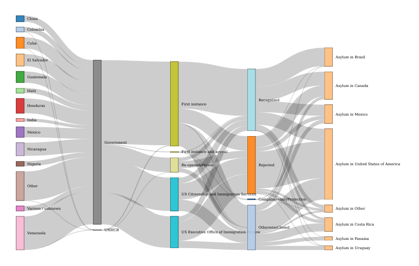

```{r setup, include=FALSE, message=FALSE, warning=FALSE}
knitr::opts_chunk$set(echo = FALSE)
```

```{r packages, include=FALSE, message=FALSE, warning=FALSE}

using <- function(...) {
    libs <- unlist(list(...))
    req <- unlist(lapply(libs,require,character.only = TRUE))
    need <- libs[req == FALSE]
    if (length(need) > 0) { 
        install.packages(need)
        lapply(need,require,character.only = TRUE)
    }
}

using('tidyverse', 'ggplot2', 'scales',  'wbstats', 'ragg', 'magick', 'acled.api', 'circlize',
      'viridis', 'treemap',
      'treemapify', 'patchwork', 'networkD3', 'webshot')

library(tidyverse)
library(ggplot2)
library(scales)
library(ragg)
library(magick)
library(circlize)
library(wbstats)
library(acled.api)

# Load required packages for charts with UNHCR style 
library(unhcRstyle)
library(unhcrdatapackage)
update_geom_font_defaults()


```

```{r  include=FALSE, message=FALSE, warning=FALSE}
## Loading the stat tables
end_year_population_totals <- unhcrdatapackage::end_year_population_totals
reference <- unhcrdatapackage::reference
end_year_population_totals_long <- unhcrdatapackage::end_year_population_totals_long
end_year_population_totals_long.asy <- dplyr::left_join( x= unhcrdatapackage::end_year_population_totals_long, 
                                                     y= unhcrdatapackage::reference, 
                                                     by = c("CountryAsylumCode" = "iso_3"))

end_year_population_totals_long.ori <- dplyr::left_join( x= unhcrdatapackage::end_year_population_totals_long, 
                                                     y= unhcrdatapackage::reference, 
                                                     by = c("CountryOriginCode" = "iso_3"))

demographics <- unhcrdatapackage::demographics
asylum_applications <- unhcrdatapackage::asylum_applications
asylum_decisions <- unhcrdatapackage::asylum_decisions
asylum_decisions_long <- unhcrdatapackage::asylum_decisions_long

solutions <- unhcrdatapackage::solutions
solutions_long <- unhcrdatapackage::solutions_long
solutions_long.asy <- dplyr::left_join( x=  solutions_long, 
                                                     y= unhcrdatapackage::reference, 
                                                     by = c("CountryAsylumCode" = "iso_3"))
```


```{r  include=FALSE, message=FALSE, warning=FALSE}
## Key Figures calculation

## Retrieve report parameter as defined in the report YAML
#thisbureau <- "Americas"
thisbureau <- params$bureau
#lastyear <- max(end_year_population_totals_long.asy$Year)
lastyear <- params$year

allpop <- format(round(sum(end_year_population_totals_long.asy[end_year_population_totals_long.asy$UNHCRBureau == thisbureau &      end_year_population_totals_long.asy$Year ==lastyear  , 
                                     c("Value")])
             , -3),  big.mark=",")

allpop.prop <- format(round( sum(end_year_population_totals_long.asy[end_year_population_totals_long.asy$UNHCRBureau == thisbureau &      end_year_population_totals_long.asy$Year ==lastyear  , 
                                     c("Value")]) /
                               sum(end_year_population_totals_long.asy[end_year_population_totals_long.asy$Year ==lastyear  , 
                                     c("Value")]) * 100
             , 1),  big.mark=",")


totaldis <- format(round(sum(end_year_population_totals_long.asy[end_year_population_totals_long.asy$UNHCRBureau == thisbureau &      end_year_population_totals_long.asy$Year ==lastyear &
                                       end_year_population_totals_long.asy$Population.type %in% c("REF","ASY","VDA") , 
                                     c("Value")])
             , -3),  big.mark=",")

totalref <- format(round(sum(end_year_population_totals_long.asy[end_year_population_totals_long.asy$UNHCRBureau == thisbureau &      end_year_population_totals_long.asy$Year ==lastyear &
                                       end_year_population_totals_long.asy$Population.type %in% c("REF") , 
                                     c("Value")])
             , -3),  big.mark=",")

totalasy <- format(round(sum(end_year_population_totals_long.asy[end_year_population_totals_long.asy$UNHCRBureau == thisbureau &      end_year_population_totals_long.asy$Year ==lastyear &
                                       end_year_population_totals_long.asy$Population.type %in% c("ASY") , 
                                     c("Value")])
             , -3),  big.mark=",")

totalvda <- format(round(sum(end_year_population_totals_long.asy[end_year_population_totals_long.asy$UNHCRBureau == thisbureau &      end_year_population_totals_long.asy$Year ==lastyear &
                                       end_year_population_totals_long.asy$Population.type %in% c("VDA") , 
                                     c("Value")])
             , -3),  big.mark=",")

totalIDP <- format(round(sum(end_year_population_totals_long.asy[end_year_population_totals_long.asy$UNHCRBureau == thisbureau &      end_year_population_totals_long.asy$Year ==lastyear &
                                       end_year_population_totals_long.asy$Population.type =="IDP" , 
                                     c("Value")])
             , -3),  big.mark=",")

totalooc <- format(round(sum(end_year_population_totals_long.asy[end_year_population_totals_long.asy$UNHCRBureau == thisbureau &      end_year_population_totals_long.asy$Year ==lastyear &
                                       end_year_population_totals_long.asy$Population.type =="OOC" , 
                                     c("Value")])
             , -3),  big.mark=",")

totalsta <- format(round(sum(end_year_population_totals_long.asy[end_year_population_totals_long.asy$UNHCRBureau == thisbureau &      end_year_population_totals_long.asy$Year ==lastyear &
                                       end_year_population_totals_long.asy$Population.type =="STA" , 
                                     c("Value")])
             , -3),  big.mark=",")

totalret <- format(round(sum(solutions_long.asy[solutions_long.asy$UNHCRBureau == thisbureau &
                                                    solutions_long.asy$Year ==lastyear &
                                                    solutions_long.asy$Solution.type =="RET" , 
                                     c("Value")])
             , -3),  big.mark=",")
 
totalretipd <- format(round(sum(solutions_long.asy[solutions_long.asy$UNHCRBureau == thisbureau &
                                                    solutions_long.asy$Year ==lastyear &
                                                    solutions_long.asy$Solution.type =="RDP" , 
                                     c("Value")])
             , -3),  big.mark=",")

totalrst <- format(round(sum(solutions_long.asy[solutions_long.asy$UNHCRBureau == thisbureau &
                                                    solutions_long.asy$Year ==lastyear &
                                                    solutions_long.asy$Solution.type =="RST" , 
                                     c("Value")])
             , -3),  big.mark=",")

totalnat <- format(round(sum(solutions_long.asy[solutions_long.asy$UNHCRBureau == thisbureau &
                                                    solutions_long.asy$Year ==lastyear &
                                                    solutions_long.asy$Solution.type =="NAT" , 
                                     c("Value")])
             , -3),  big.mark=",")

allsol <- format(round(sum(solutions_long.asy[solutions_long.asy$UNHCRBureau == thisbureau &      solutions_long.asy$Year ==lastyear  , 
                                     c("Value")])
             , -3),  big.mark=",")

allsol.prop <- format(round( 
  sum(solutions_long.asy[solutions_long.asy$UNHCRBureau == thisbureau &      solutions_long.asy$Year ==lastyear  , 
                                     c("Value")]) / 
    sum(end_year_population_totals_long.asy[end_year_population_totals_long.asy$UNHCRBureau == thisbureau &      end_year_population_totals_long.asy$Year ==lastyear  , 
                                     c("Value")]) *100
    
             , 3),  big.mark=",")

## Profiles

#Total children below 18

#Hosted in urban/peri-urban areas

```


## Country Highlights 

### Argentina

```{r message=FALSE, warning=FALSE}
thiscountry <- "Argentina"
```

Population of Concern

```{r message=FALSE, warning=FALSE, comment = "", fig.height=4, size="small", fig.cap = "**| Evolution over time of the different Population of Concern in Argentina**"}
#Prepare data
multiple_line_df <- end_year_population_totals_long.asy %>%
  filter(CountryAsylumName  == thiscountry & Year > (lastyear - 5) ) %>%
  group_by(Year, Population.type.label.short ) %>%
  summarise(Value2 = sum(Value) ) 

#Make plot
ggplot(multiple_line_df, aes(x = Year, y = Value2 #, 
                                              #colour = Population.type
                             )) + # Adding reference to color
  #geom_line(size = 1) + # Here we mention that it will be a line chart
  
  geom_bar(stat = "identity", 
           position = "identity", 
           fill = "#0072bc"
           ) + # here we configure that it will be bar chart+
  
  geom_hline(yintercept = 0, size = 1.1, colour = "#333333") +
  scale_y_continuous( label = format_si()) + ## Format axis number
  xlim(c(lastyear-5, lastyear+1)) +
  facet_wrap( vars(Population.type.label.short ), ncol = 3) +
  unhcRstyle::unhcr_theme(base_size = 8)  + ## Insert UNHCR Style
  theme(panel.grid.major.y  = element_line(color = "#cbcbcb"), 
        panel.grid.major.x  = element_blank(), 
        panel.grid.minor = element_blank()) + ### changing grid line that should appear
  ## and the chart labels
  labs(title = "Key message for this chart ",
       subtitle = " ",
       x = "",
       y = "",
       caption = "Source: UNHCR.org/refugee-statistics ")

```


Solutions

```{r message=FALSE, warning=FALSE, comment = "", fig.height=4, size="small", fig.cap = "**| Solutions in Argentina**"}
#Prepare data
multiple_line_df <- solutions_long.asy %>%
  filter(CountryAsylumName  == thiscountry & Year > (lastyear - 5)  ) %>%
  group_by(Year, Solution.type.label ) %>%
  summarise(Value2 = sum(Value) )  %>%
  mutate(Year = as.integer(Year) ) 

#Make plot
ggplot(multiple_line_df, aes(x = Year, y = Value2 #, 
                                              #colour = Population.type
                             )) + 
  geom_bar(stat = "identity", 
           position = "identity", 
           fill = "#0072bc" ) + # here we configure that it will be bar chart
  
  scale_y_continuous( label = format_si()) + ## Format axis number
  xlim(c(lastyear-5, lastyear+1)) +
  facet_wrap( vars(Solution.type.label ), ncol = 2) +

  geom_hline(yintercept = 0, size = 1.1, colour = "#333333") +
  unhcRstyle::unhcr_theme(base_size = 8)  + ## Insert UNHCR Style
  theme(panel.grid.major.y  = element_line(color = "#cbcbcb"), 
        panel.grid.major.x  = element_blank(), 
        panel.grid.minor = element_blank()) + ### changing grid line that should appear
  ## and the chart labels
  labs(title = "Key message for this chart ",
       subtitle = " ",
       x = "",
       y = "",
       caption = "Source: UNHCR.org/refugee-statistics ")

```


RSD activities are mostly for ..

```{r message=FALSE, warning=FALSE, comment = "", fig.height=4, size="small", fig.cap = "**| Asylum Decision in Argentina**"}
linksDecision.Ori.Procedure <- asylum_decisions_long %>%
  ## Add reference for the filters
  dplyr::left_join( unhcrdatapackage::reference %>% 
                      select(coa_region = `UNHCRBureau`, iso_3),  by = c("CountryAsylumCode" = "iso_3")) %>% 
  filter(coa_region == thisbureau & Year == lastyear  & CountryAsylumName  == thiscountry) %>% 
  ## Group small records under other
  mutate(CountryOriginName = forcats::fct_lump_prop(CountryOriginName, prop = .01, w = Value)) %>% 
  mutate(CountryOriginName = str_replace(CountryOriginName, " \\(Bolivarian Republic of\\)", "")) %>% 
  ## Calculate grouped value for Origin to procedure..
  group_by(CountryOriginName, ProcedureName ) %>%
  summarise(value = sum(Value) ) %>%
  ## Rename variable
  rename(source = CountryOriginName) %>%
  rename(target = ProcedureName) 

linksDecision.Procedure.Type <- asylum_decisions_long %>%
  ## Add reference for the filters
  dplyr::left_join( unhcrdatapackage::reference %>% 
                      select(coa_region = `UNHCRBureau`, iso_3),  by = c("CountryAsylumCode" = "iso_3")) %>% 
  filter(coa_region == thisbureau & Year == lastyear   & CountryAsylumName  == thiscountry) %>% 
  ## Group small records under other
  ## Calculate grouped value for Origin to procedure..
  group_by(ProcedureName, DecisionTypeName ) %>%
  summarise(value = sum(Value) ) %>%
  ## Rename variable
  rename(source = ProcedureName) %>%
  rename(target = DecisionTypeName) 

linksDecision.Type.Output <- asylum_decisions_long %>%
  ## Add reference for the filters
  dplyr::left_join( unhcrdatapackage::reference %>% 
                      select(coa_region = `UNHCRBureau`, iso_3),  by = c("CountryAsylumCode" = "iso_3")) %>% 
  filter(coa_region == thisbureau & Year == lastyear   & CountryAsylumName  == thiscountry) %>% 
  ## Group small records under other
  ## Calculate grouped value for Origin to procedure..
  group_by(DecisionTypeName,Decision.output ) %>%
  summarise(value = sum(Value) ) %>%
  ## Rename variable
  rename(source = DecisionTypeName) %>%
  rename(target = Decision.output)

 

linksallDecision <- rbind(linksDecision.Ori.Procedure,
                  linksDecision.Procedure.Type,
                  linksDecision.Type.Output )


# From these flows we need to create a node data frame: it lists every entities involved in the flow
nodesDecision <- data.frame(
  name=c(as.character(linksallDecision$source), 
         as.character(linksallDecision$target)) %>% unique()
)

# With networkD3, connection must be provided using id, not using real name like in the links dataframe.. So we need to reformat it.
linksallDecision$IDsource <- match(linksallDecision$source, nodesDecision$name)-1 
linksallDecision$IDtarget <- match(linksallDecision$target, nodesDecision$name)-1

# Make the Network
p <- networkD3::sankeyNetwork(Links = linksallDecision, 
                              Nodes = nodesDecision,
                              Source = "IDsource", 
                              Target = "IDtarget",
                              Value = "value", 
                              NodeID = "name", 
                              # LinkGroup	 character string specifying the groups in the Links. Used to color the links in the network.
                              sinksRight=FALSE) ##  If TRUE, the last nodes are moved to the right border of the plot.
# you save it as an html
networkD3::saveNetwork(p, "decisionarg.html")

# you convert it as png -- Need first webshot::install_phantomjs()
webshot::webshot(paste0(getwd(),"/decisionarg.html"),paste0(getwd(),"/graph/decisionarg.png"), vwidth = 800, vheight = 500)
#getwd()
#

```

### Brazil

```{r message=FALSE, warning=FALSE}
thiscountry <- "Brazil"
```

Population of Concern

```{r message=FALSE, warning=FALSE, comment = "", fig.height=4, size="small", fig.cap = "**| Evolution over time of the different Population of Concern in Brazil**"}
#Prepare data
multiple_line_df <- end_year_population_totals_long.asy %>%
  filter(CountryAsylumName  == thiscountry & Year > (lastyear - 5) ) %>%
  group_by(Year, Population.type.label.short ) %>%
  summarise(Value2 = sum(Value) ) 

#Make plot
ggplot(multiple_line_df, aes(x = Year, y = Value2 #, 
                                              #colour = Population.type
                             )) + # Adding reference to color
  #geom_line(size = 1) + # Here we mention that it will be a line chart
  
  geom_bar(stat = "identity", 
           position = "identity", 
           fill = "#0072bc"
           ) + # here we configure that it will be bar chart+
  
  geom_hline(yintercept = 0, size = 1.1, colour = "#333333") +
  scale_y_continuous( label = format_si()) + ## Format axis number
  xlim(c(lastyear-5, lastyear+1)) +
  facet_wrap( vars(Population.type.label.short ), ncol = 3) +
  unhcRstyle::unhcr_theme(base_size = 8)  + ## Insert UNHCR Style
  theme(panel.grid.major.y  = element_line(color = "#cbcbcb"), 
        panel.grid.major.x  = element_blank(), 
        panel.grid.minor = element_blank()) + ### changing grid line that should appear
  ## and the chart labels
  labs(title = "Key message for this chart ",
       subtitle = " ",
       x = "",
       y = "",
       caption = "Source: UNHCR.org/refugee-statistics ")

```

Solutions


```{r message=FALSE, warning=FALSE, comment = "", fig.height=4, size="small", fig.cap = "**| Solutions in Brazil**"}
#Prepare data
multiple_line_df <- solutions_long.asy %>%
  filter(CountryAsylumName  == thiscountry & Year > (lastyear - 5)  ) %>%
  group_by(Year, Solution.type.label ) %>%
  summarise(Value2 = sum(Value) )  %>%
  mutate(Year = as.integer(Year) ) 

#Make plot
ggplot(multiple_line_df, aes(x = Year, y = Value2 #, 
                                              #colour = Population.type
                             )) + 
  geom_bar(stat = "identity", 
           position = "identity", 
           fill = "#0072bc" ) + # here we configure that it will be bar chart
  
  scale_y_continuous( label = format_si()) + ## Format axis number
  xlim(c(lastyear-5, lastyear+1)) +
  facet_wrap( vars(Solution.type.label ), ncol = 2) +

  geom_hline(yintercept = 0, size = 1.1, colour = "#333333") +
  unhcRstyle::unhcr_theme(base_size = 8)  + ## Insert UNHCR Style
  theme(panel.grid.major.y  = element_line(color = "#cbcbcb"), 
        panel.grid.major.x  = element_blank(), 
        panel.grid.minor = element_blank()) + ### changing grid line that should appear
  ## and the chart labels
  labs(title = "Key message for this chart ",
       subtitle = " ",
       x = "",
       y = "",
       caption = "Source: UNHCR.org/refugee-statistics ")

```


RSD activities are mostly for ..

```{r message=FALSE, warning=FALSE, comment = "", fig.height=4, size="small", fig.cap = "**| Asylum Decision in Brazil**"}
linksDecision.Ori.Procedure <- asylum_decisions_long %>%
  ## Add reference for the filters
  dplyr::left_join( unhcrdatapackage::reference %>% 
                      select(coa_region = `UNHCRBureau`, iso_3),  by = c("CountryAsylumCode" = "iso_3")) %>% 
  filter(coa_region == thisbureau & Year == lastyear  & CountryAsylumName  == thiscountry) %>% 
  ## Group small records under other
  mutate(CountryOriginName = forcats::fct_lump_prop(CountryOriginName, prop = .01, w = Value)) %>% 
  mutate(CountryOriginName = str_replace(CountryOriginName, " \\(Bolivarian Republic of\\)", "")) %>% 
  ## Calculate grouped value for Origin to procedure..
  group_by(CountryOriginName, ProcedureName ) %>%
  summarise(value = sum(Value) ) %>%
  ## Rename variable
  rename(source = CountryOriginName) %>%
  rename(target = ProcedureName) 

linksDecision.Procedure.Type <- asylum_decisions_long %>%
  ## Add reference for the filters
  dplyr::left_join( unhcrdatapackage::reference %>% 
                      select(coa_region = `UNHCRBureau`, iso_3),  by = c("CountryAsylumCode" = "iso_3")) %>% 
  filter(coa_region == thisbureau & Year == lastyear   & CountryAsylumName  == thiscountry) %>% 
  ## Group small records under other
  ## Calculate grouped value for Origin to procedure..
  group_by(ProcedureName, DecisionTypeName ) %>%
  summarise(value = sum(Value) ) %>%
  ## Rename variable
  rename(source = ProcedureName) %>%
  rename(target = DecisionTypeName) 

linksDecision.Type.Output <- asylum_decisions_long %>%
  ## Add reference for the filters
  dplyr::left_join( unhcrdatapackage::reference %>% 
                      select(coa_region = `UNHCRBureau`, iso_3),  by = c("CountryAsylumCode" = "iso_3")) %>% 
  filter(coa_region == thisbureau & Year == lastyear   & CountryAsylumName  == thiscountry) %>% 
  ## Group small records under other
  ## Calculate grouped value for Origin to procedure..
  group_by(DecisionTypeName,Decision.output ) %>%
  summarise(value = sum(Value) ) %>%
  ## Rename variable
  rename(source = DecisionTypeName) %>%
  rename(target = Decision.output)

 

linksallDecision <- rbind(linksDecision.Ori.Procedure,
                  linksDecision.Procedure.Type,
                  linksDecision.Type.Output )


# From these flows we need to create a node data frame: it lists every entities involved in the flow
nodesDecision <- data.frame(
  name=c(as.character(linksallDecision$source), 
         as.character(linksallDecision$target)) %>% unique()
)

# With networkD3, connection must be provided using id, not using real name like in the links dataframe.. So we need to reformat it.
linksallDecision$IDsource <- match(linksallDecision$source, nodesDecision$name)-1 
linksallDecision$IDtarget <- match(linksallDecision$target, nodesDecision$name)-1

# Make the Network
p <- networkD3::sankeyNetwork(Links = linksallDecision, 
                              Nodes = nodesDecision,
                              Source = "IDsource", 
                              Target = "IDtarget",
                              Value = "value", 
                              NodeID = "name", 
                              # LinkGroup	 character string specifying the groups in the Links. Used to color the links in the network.
                              sinksRight=FALSE) ##  If TRUE, the last nodes are moved to the right border of the plot.
# you save it as an html
networkD3::saveNetwork(p, "decisionbra.html")

# you convert it as png -- Need first webshot::install_phantomjs()
webshot::webshot(paste0(getwd(),"/decisionbra.html"),paste0(getwd(),"/graph/decisionbra.png"), vwidth = 800, vheight = 500)
#getwd()
#

```


### Canada

```{r message=FALSE, warning=FALSE}
thiscountry <- "Canada"
```

Population of Concern

```{r message=FALSE, warning=FALSE, comment = "", fig.height=4, size="small", fig.cap = "**| Evolution over time of the different Population of Concern in Canada**"}
#Prepare data
multiple_line_df <- end_year_population_totals_long.asy %>%
  filter(CountryAsylumName  == thiscountry & Year > (lastyear - 5) ) %>%
  group_by(Year, Population.type.label.short ) %>%
  summarise(Value2 = sum(Value) ) 

#Make plot
ggplot(multiple_line_df, aes(x = Year, y = Value2 #, 
                                              #colour = Population.type
                             )) + # Adding reference to color
  #geom_line(size = 1) + # Here we mention that it will be a line chart
  
  geom_bar(stat = "identity", 
           position = "identity", 
           fill = "#0072bc"
           ) + # here we configure that it will be bar chart+
  
  geom_hline(yintercept = 0, size = 1.1, colour = "#333333") +
  scale_y_continuous( label = format_si()) + ## Format axis number
  xlim(c(lastyear-5, lastyear+1)) +
  facet_wrap( vars(Population.type.label.short ), ncol = 3) +
  unhcRstyle::unhcr_theme(base_size = 8)  + ## Insert UNHCR Style
  theme(panel.grid.major.y  = element_line(color = "#cbcbcb"), 
        panel.grid.major.x  = element_blank(), 
        panel.grid.minor = element_blank()) + ### changing grid line that should appear
  ## and the chart labels
  labs(title = "Key message for this chart ",
       subtitle = " ",
       x = "",
       y = "",
       caption = "Source: UNHCR.org/refugee-statistics ")

```

Solutions


```{r message=FALSE, warning=FALSE, comment = "", fig.height=4, size="small", fig.cap = "**| Solutions in Canada**"}
#Prepare data
multiple_line_df <- solutions_long.asy %>%
  filter(CountryAsylumName  == thiscountry & Year > (lastyear - 5)  ) %>%
  group_by(Year, Solution.type.label ) %>%
  summarise(Value2 = sum(Value) )  %>%
  mutate(Year = as.integer(Year) ) 

#Make plot
ggplot(multiple_line_df, aes(x = Year, y = Value2 #, 
                                              #colour = Population.type
                             )) + 
  geom_bar(stat = "identity", 
           position = "identity", 
           fill = "#0072bc" ) + # here we configure that it will be bar chart
  
  scale_y_continuous( label = format_si()) + ## Format axis number
  xlim(c(lastyear-5, lastyear+1)) +
  facet_wrap( vars(Solution.type.label ), ncol = 2) +

  geom_hline(yintercept = 0, size = 1.1, colour = "#333333") +
  unhcRstyle::unhcr_theme(base_size = 8)  + ## Insert UNHCR Style
  theme(panel.grid.major.y  = element_line(color = "#cbcbcb"), 
        panel.grid.major.x  = element_blank(), 
        panel.grid.minor = element_blank()) + ### changing grid line that should appear
  ## and the chart labels
  labs(title = "Key message for this chart ",
       subtitle = " ",
       x = "",
       y = "",
       caption = "Source: UNHCR.org/refugee-statistics ")

```


RSD activities are mostly for ..

```{r message=FALSE, warning=FALSE, comment = "", fig.height=4, size="small", fig.cap = "**| Asylum Decision in Canada**"}
linksDecision.Ori.Procedure <- asylum_decisions_long %>%
  ## Add reference for the filters
  dplyr::left_join( unhcrdatapackage::reference %>% 
                      select(coa_region = `UNHCRBureau`, iso_3),  by = c("CountryAsylumCode" = "iso_3")) %>% 
  filter(coa_region == thisbureau & Year == lastyear  & CountryAsylumName  == thiscountry) %>% 
  ## Group small records under other
  mutate(CountryOriginName = forcats::fct_lump_prop(CountryOriginName, prop = .01, w = Value)) %>% 
  mutate(CountryOriginName = str_replace(CountryOriginName, " \\(Bolivarian Republic of\\)", "")) %>% 
  ## Calculate grouped value for Origin to procedure..
  group_by(CountryOriginName, ProcedureName ) %>%
  summarise(value = sum(Value) ) %>%
  ## Rename variable
  rename(source = CountryOriginName) %>%
  rename(target = ProcedureName) 

linksDecision.Procedure.Type <- asylum_decisions_long %>%
  ## Add reference for the filters
  dplyr::left_join( unhcrdatapackage::reference %>% 
                      select(coa_region = `UNHCRBureau`, iso_3),  by = c("CountryAsylumCode" = "iso_3")) %>% 
  filter(coa_region == thisbureau & Year == lastyear   & CountryAsylumName  == thiscountry) %>% 
  ## Group small records under other
  ## Calculate grouped value for Origin to procedure..
  group_by(ProcedureName, DecisionTypeName ) %>%
  summarise(value = sum(Value) ) %>%
  ## Rename variable
  rename(source = ProcedureName) %>%
  rename(target = DecisionTypeName) 

linksDecision.Type.Output <- asylum_decisions_long %>%
  ## Add reference for the filters
  dplyr::left_join( unhcrdatapackage::reference %>% 
                      select(coa_region = `UNHCRBureau`, iso_3),  by = c("CountryAsylumCode" = "iso_3")) %>% 
  filter(coa_region == thisbureau & Year == lastyear   & CountryAsylumName  == thiscountry) %>% 
  ## Group small records under other
  ## Calculate grouped value for Origin to procedure..
  group_by(DecisionTypeName,Decision.output ) %>%
  summarise(value = sum(Value) ) %>%
  ## Rename variable
  rename(source = DecisionTypeName) %>%
  rename(target = Decision.output)

 

linksallDecision <- rbind(linksDecision.Ori.Procedure,
                  linksDecision.Procedure.Type,
                  linksDecision.Type.Output )


# From these flows we need to create a node data frame: it lists every entities involved in the flow
nodesDecision <- data.frame(
  name=c(as.character(linksallDecision$source), 
         as.character(linksallDecision$target)) %>% unique()
)

# With networkD3, connection must be provided using id, not using real name like in the links dataframe.. So we need to reformat it.
linksallDecision$IDsource <- match(linksallDecision$source, nodesDecision$name)-1 
linksallDecision$IDtarget <- match(linksallDecision$target, nodesDecision$name)-1

# Make the Network
p <- networkD3::sankeyNetwork(Links = linksallDecision, 
                              Nodes = nodesDecision,
                              Source = "IDsource", 
                              Target = "IDtarget",
                              Value = "value", 
                              NodeID = "name", 
                              # LinkGroup	 character string specifying the groups in the Links. Used to color the links in the network.
                              sinksRight=FALSE) ##  If TRUE, the last nodes are moved to the right border of the plot.
# you save it as an html
networkD3::saveNetwork(p, "decisioncan.html")

# you convert it as png -- Need first webshot::install_phantomjs()
webshot::webshot(paste0(getwd(),"/decisioncan.html"),paste0(getwd(),"/graph/decisioncan.png"), vwidth = 800, vheight = 500)
#getwd()
#

```

### Chile

```{r message=FALSE, warning=FALSE}
thiscountry <- "Chile"
```

Population of Concern

```{r message=FALSE, warning=FALSE, comment = "", fig.height=4, size="small", fig.cap = "**| Evolution over time of the different Population of Concern in Chile**"}
#Prepare data
multiple_line_df <- end_year_population_totals_long.asy %>%
  filter(CountryAsylumName  == thiscountry & Year > (lastyear - 5) ) %>%
  group_by(Year, Population.type.label.short ) %>%
  summarise(Value2 = sum(Value) ) 

#Make plot
ggplot(multiple_line_df, aes(x = Year, y = Value2 #, 
                                              #colour = Population.type
                             )) + # Adding reference to color
  #geom_line(size = 1) + # Here we mention that it will be a line chart
  
  geom_bar(stat = "identity", 
           position = "identity", 
           fill = "#0072bc"
           ) + # here we configure that it will be bar chart+
  
  geom_hline(yintercept = 0, size = 1.1, colour = "#333333") +
  scale_y_continuous( label = format_si()) + ## Format axis number
  xlim(c(lastyear-5, lastyear+1)) +
  facet_wrap( vars(Population.type.label.short ), ncol = 3) +
  unhcRstyle::unhcr_theme(base_size = 8)  + ## Insert UNHCR Style
  theme(panel.grid.major.y  = element_line(color = "#cbcbcb"), 
        panel.grid.major.x  = element_blank(), 
        panel.grid.minor = element_blank()) + ### changing grid line that should appear
  ## and the chart labels
  labs(title = "Chile is similar to Ecuador ",
       subtitle = " ",
       x = "",
       y = "",
       caption = "Source: UNHCR.org/refugee-statistics ")

```


Solutions

```{r message=FALSE, warning=FALSE, comment = "", fig.height=4, size="small", fig.cap = "**| Solutions in Chile**"}
#Prepare data
multiple_line_df <- solutions_long.asy %>%
  filter(CountryAsylumName  == thiscountry & Year > (lastyear - 5)  ) %>%
  group_by(Year, Solution.type.label ) %>%
  summarise(Value2 = sum(Value) )  %>%
  mutate(Year = as.integer(Year) ) 

#Make plot
ggplot(multiple_line_df, aes(x = Year, y = Value2 #, 
                                              #colour = Population.type
                             )) + 
  geom_bar(stat = "identity", 
           position = "identity", 
           fill = "#0072bc" ) + # here we configure that it will be bar chart
  
  scale_y_continuous( label = format_si()) + ## Format axis number
  xlim(c(lastyear-5, lastyear+1)) +
  facet_wrap( vars(Solution.type.label ), ncol = 2) +

  geom_hline(yintercept = 0, size = 1.1, colour = "#333333") +
  unhcRstyle::unhcr_theme(base_size = 8)  + ## Insert UNHCR Style
  theme(panel.grid.major.y  = element_line(color = "#cbcbcb"), 
        panel.grid.major.x  = element_blank(), 
        panel.grid.minor = element_blank()) + ### changing grid line that should appear
  ## and the chart labels
  labs(title = "Key message for this chart ",
       subtitle = " ",
       x = "",
       y = "",
       caption = "Source: UNHCR.org/refugee-statistics ")

```

RSD activities are mostly for ..

```{r message=FALSE, warning=FALSE, comment = "", fig.height=4, size="small", fig.cap = "**| Asylum Decision in Chile**"}
linksDecision.Ori.Procedure <- asylum_decisions_long %>%
  ## Add reference for the filters
  dplyr::left_join( unhcrdatapackage::reference %>% 
                      select(coa_region = `UNHCRBureau`, iso_3),  by = c("CountryAsylumCode" = "iso_3")) %>% 
  filter(coa_region == thisbureau & Year == lastyear  & CountryAsylumName  == thiscountry) %>% 
  ## Group small records under other
  mutate(CountryOriginName = forcats::fct_lump_prop(CountryOriginName, prop = .01, w = Value)) %>% 
  mutate(CountryOriginName = str_replace(CountryOriginName, " \\(Bolivarian Republic of\\)", "")) %>% 
  ## Calculate grouped value for Origin to procedure..
  group_by(CountryOriginName, ProcedureName ) %>%
  summarise(value = sum(Value) ) %>%
  ## Rename variable
  rename(source = CountryOriginName) %>%
  rename(target = ProcedureName) 

linksDecision.Procedure.Type <- asylum_decisions_long %>%
  ## Add reference for the filters
  dplyr::left_join( unhcrdatapackage::reference %>% 
                      select(coa_region = `UNHCRBureau`, iso_3),  by = c("CountryAsylumCode" = "iso_3")) %>% 
  filter(coa_region == thisbureau & Year == lastyear   & CountryAsylumName  == thiscountry) %>% 
  ## Group small records under other
  ## Calculate grouped value for Origin to procedure..
  group_by(ProcedureName, DecisionTypeName ) %>%
  summarise(value = sum(Value) ) %>%
  ## Rename variable
  rename(source = ProcedureName) %>%
  rename(target = DecisionTypeName) 

linksDecision.Type.Output <- asylum_decisions_long %>%
  ## Add reference for the filters
  dplyr::left_join( unhcrdatapackage::reference %>% 
                      select(coa_region = `UNHCRBureau`, iso_3),  by = c("CountryAsylumCode" = "iso_3")) %>% 
  filter(coa_region == thisbureau & Year == lastyear   & CountryAsylumName  == thiscountry) %>% 
  ## Group small records under other
  ## Calculate grouped value for Origin to procedure..
  group_by(DecisionTypeName,Decision.output ) %>%
  summarise(value = sum(Value) ) %>%
  ## Rename variable
  rename(source = DecisionTypeName) %>%
  rename(target = Decision.output)

 

linksallDecision <- rbind(linksDecision.Ori.Procedure,
                  linksDecision.Procedure.Type,
                  linksDecision.Type.Output )


# From these flows we need to create a node data frame: it lists every entities involved in the flow
nodesDecision <- data.frame(
  name=c(as.character(linksallDecision$source), 
         as.character(linksallDecision$target)) %>% unique()
)

# With networkD3, connection must be provided using id, not using real name like in the links dataframe.. So we need to reformat it.
linksallDecision$IDsource <- match(linksallDecision$source, nodesDecision$name)-1 
linksallDecision$IDtarget <- match(linksallDecision$target, nodesDecision$name)-1

# Make the Network
p <- networkD3::sankeyNetwork(Links = linksallDecision, 
                              Nodes = nodesDecision,
                              Source = "IDsource", 
                              Target = "IDtarget",
                              Value = "value", 
                              NodeID = "name", 
                              # LinkGroup	 character string specifying the groups in the Links. Used to color the links in the network.
                              sinksRight=FALSE) ##  If TRUE, the last nodes are moved to the right border of the plot.
# you save it as an html
networkD3::saveNetwork(p, "decisionchl.html")

# you convert it as png -- Need first webshot::install_phantomjs()
webshot::webshot(paste0(getwd(),"/decisionchl.html"),paste0(getwd(),"/graph/decisionchl.png"), vwidth = 800, vheight = 500)
#getwd()
#

```


### Colombia

```{r message=FALSE, warning=FALSE}
thiscountry <- "Colombia"
```

Population of Concern

```{r message=FALSE, warning=FALSE, comment = "", fig.height=4, size="small", fig.cap = "**| Evolution over time of the different Population of Concern in Colombia**"}
#Prepare data
multiple_line_df <- end_year_population_totals_long.asy %>%
  filter(CountryAsylumName  == thiscountry & Year > (lastyear - 5) ) %>%
  group_by(Year, Population.type.label.short ) %>%
  summarise(Value2 = sum(Value) ) 

#Make plot
ggplot(multiple_line_df, aes(x = Year, y = Value2 #, 
                                              #colour = Population.type
                             )) + # Adding reference to color
  #geom_line(size = 1) + # Here we mention that it will be a line chart
  
  geom_bar(stat = "identity", 
           position = "identity", 
           fill = "#0072bc"
           ) + # here we configure that it will be bar chart+
  
  geom_hline(yintercept = 0, size = 1.1, colour = "#333333") +
  scale_y_continuous( label = format_si()) + ## Format axis number
  xlim(c(lastyear-5, lastyear+1)) +
  facet_wrap( vars(Population.type.label.short ), ncol = 3) +
  unhcRstyle::unhcr_theme(base_size = 8)  + ## Insert UNHCR Style
  theme(panel.grid.major.y  = element_line(color = "#cbcbcb"), 
        panel.grid.major.x  = element_blank(), 
        panel.grid.minor = element_blank()) + ### changing grid line that should appear
  ## and the chart labels
  labs(title = "Key message for this chart ",
       subtitle = " ",
       x = "",
       y = "",
       caption = "Source: UNHCR.org/refugee-statistics ")

```


No solutions recorded in __`r thiscountry`__

```{r message=FALSE, warning=FALSE, comment = "", fig.height=4, size="small", fig.cap = "**| Solutions**"}
# #Prepare data
# multiple_line_df <- solutions_long.asy %>%
#   filter(CountryAsylumName  == thiscountry & Year > (lastyear - 5)  ) %>%
#   group_by(Year, Solution.type.label ) %>%
#   summarise(Value2 = sum(Value) )  %>%
#   mutate(Year = as.integer(Year) ) 
# 
# #Make plot
# ggplot(multiple_line_df, aes(x = Year, y = Value2 #, 
#                                               #colour = Population.type
#                              )) + 
#   geom_bar(stat = "identity", 
#            position = "identity", 
#            fill = "#0072bc" ) + # here we configure that it will be bar chart
#   
#   scale_y_continuous( label = format_si()) + ## Format axis number
#   xlim(c(lastyear-5, lastyear+1)) +
#   facet_wrap( vars(Solution.type.label ), ncol = 2) +
# 
#   geom_hline(yintercept = 0, size = 1.1, colour = "#333333") +
#   unhcRstyle::unhcr_theme(base_size = 8)  + ## Insert UNHCR Style
#   theme(panel.grid.major.y  = element_line(color = "#cbcbcb"), 
#         panel.grid.major.x  = element_blank(), 
#         panel.grid.minor = element_blank()) + ### changing grid line that should appear
#   ## and the chart labels
#   labs(title = "Key message for this chart ",
#        subtitle = " ",
#        x = "",
#        y = "",
#        caption = "Source: UNHCR.org/refugee-statistics ")

```

RSD activities are mostly for Venezuelan

```{r message=FALSE, warning=FALSE, comment = "", fig.height=4, size="small", fig.cap = "**| Asylum Decision in Colombia**"}
linksDecision.Ori.Procedure <- asylum_decisions_long %>%
  ## Add reference for the filters
  dplyr::left_join( unhcrdatapackage::reference %>% 
                      select(coa_region = `UNHCRBureau`, iso_3),  by = c("CountryAsylumCode" = "iso_3")) %>% 
  filter(coa_region == thisbureau & Year == lastyear  & CountryAsylumName  == thiscountry) %>% 
  ## Group small records under other
  mutate(CountryOriginName = forcats::fct_lump_prop(CountryOriginName, prop = .01, w = Value)) %>% 
  mutate(CountryOriginName = str_replace(CountryOriginName, " \\(Bolivarian Republic of\\)", "")) %>% 
  ## Calculate grouped value for Origin to procedure..
  group_by(CountryOriginName, ProcedureName ) %>%
  summarise(value = sum(Value) ) %>%
  ## Rename variable
  rename(source = CountryOriginName) %>%
  rename(target = ProcedureName) 

linksDecision.Procedure.Type <- asylum_decisions_long %>%
  ## Add reference for the filters
  dplyr::left_join( unhcrdatapackage::reference %>% 
                      select(coa_region = `UNHCRBureau`, iso_3),  by = c("CountryAsylumCode" = "iso_3")) %>% 
  filter(coa_region == thisbureau & Year == lastyear   & CountryAsylumName  == thiscountry) %>% 
  ## Group small records under other
  ## Calculate grouped value for Origin to procedure..
  group_by(ProcedureName, DecisionTypeName ) %>%
  summarise(value = sum(Value) ) %>%
  ## Rename variable
  rename(source = ProcedureName) %>%
  rename(target = DecisionTypeName) 

linksDecision.Type.Output <- asylum_decisions_long %>%
  ## Add reference for the filters
  dplyr::left_join( unhcrdatapackage::reference %>% 
                      select(coa_region = `UNHCRBureau`, iso_3),  by = c("CountryAsylumCode" = "iso_3")) %>% 
  filter(coa_region == thisbureau & Year == lastyear   & CountryAsylumName  == thiscountry) %>% 
  ## Group small records under other
  ## Calculate grouped value for Origin to procedure..
  group_by(DecisionTypeName,Decision.output ) %>%
  summarise(value = sum(Value) ) %>%
  ## Rename variable
  rename(source = DecisionTypeName) %>%
  rename(target = Decision.output)

 

linksallDecision <- rbind(linksDecision.Ori.Procedure,
                  linksDecision.Procedure.Type,
                  linksDecision.Type.Output )


# From these flows we need to create a node data frame: it lists every entities involved in the flow
nodesDecision <- data.frame(
  name=c(as.character(linksallDecision$source), 
         as.character(linksallDecision$target)) %>% unique()
)

# With networkD3, connection must be provided using id, not using real name like in the links dataframe.. So we need to reformat it.
linksallDecision$IDsource <- match(linksallDecision$source, nodesDecision$name)-1 
linksallDecision$IDtarget <- match(linksallDecision$target, nodesDecision$name)-1

# Make the Network
p <- networkD3::sankeyNetwork(Links = linksallDecision, 
                              Nodes = nodesDecision,
                              Source = "IDsource", 
                              Target = "IDtarget",
                              Value = "value", 
                              NodeID = "name", 
                              # LinkGroup	 character string specifying the groups in the Links. Used to color the links in the network.
                              sinksRight=FALSE) ##  If TRUE, the last nodes are moved to the right border of the plot.
# you save it as an html
networkD3::saveNetwork(p, "decisioncol.html")

# you convert it as png -- Need first webshot::install_phantomjs()
webshot::webshot(paste0(getwd(),"/decisioncol.html"),paste0(getwd(),"/graph/decisioncol.png"), vwidth = 800, vheight = 500)
#getwd()
#

```

### Ecuador

```{r message=FALSE, warning=FALSE}
thiscountry <- "Ecuador"
```

Population of Concern


```{r message=FALSE, warning=FALSE, comment = "", fig.height=4, size="small", fig.cap = "**| Evolution over time of the different Population of Concern in Ecuador**"}
#Prepare data
multiple_line_df <- end_year_population_totals_long.asy %>%
  filter(CountryAsylumName  == thiscountry & Year > (lastyear - 5) ) %>%
  group_by(Year, Population.type.label.short ) %>%
  summarise(Value2 = sum(Value) ) 

#Make plot
ggplot(multiple_line_df, aes(x = Year, y = Value2 #, 
                                              #colour = Population.type
                             )) + # Adding reference to color
  #geom_line(size = 1) + # Here we mention that it will be a line chart
  
  geom_bar(stat = "identity", 
           position = "identity", 
           fill = "#0072bc"
           ) + # here we configure that it will be bar chart+
  
  geom_hline(yintercept = 0, size = 1.1, colour = "#333333") +
  xlim(c(lastyear-5, lastyear+1)) +
  scale_y_continuous( label = format_si()) + ## Format axis number
  facet_wrap( vars(Population.type.label.short ), ncol = 3) +
  unhcRstyle::unhcr_theme(base_size = 8)  + ## Insert UNHCR Style
  theme(panel.grid.major.y  = element_line(color = "#cbcbcb"), 
        panel.grid.major.x  = element_blank(), 
        panel.grid.minor = element_blank()) + ### changing grid line that should appear
  ## and the chart labels
  labs(title = "In Ecuador, a stable Refugee population ",
       subtitle = "and a growing population of Venezuelan Abroad ",
       x = "",
       y = "",
       caption = "Source: UNHCR.org/refugee-statistics ")

```


Solutions

```{r message=FALSE, warning=FALSE, comment = "", fig.height=4, size="small", fig.cap = "**| Solutions  in Ecuador**"}
#Prepare data
multiple_line_df <- solutions_long.asy %>%
  filter(CountryAsylumName  == thiscountry & Year > (lastyear - 5)  ) %>%
  group_by(Year, Solution.type.label ) %>%
  summarise(Value2 = sum(Value) )  %>%
  mutate(Year = as.integer(Year) ) 

#Make plot
ggplot(multiple_line_df, aes(x = Year, y = Value2 #, 
                                              #colour = Population.type
                             )) + 
  geom_bar(stat = "identity", 
           position = "identity", 
           fill = "#0072bc" ) + # here we configure that it will be bar chart
  
  scale_y_continuous( label = format_si()) + ## Format axis number
  xlim(c(lastyear-5, lastyear+1)) +
  facet_wrap( vars(Solution.type.label ), ncol = 2) +

  geom_hline(yintercept = 0, size = 1.1, colour = "#333333") +
  unhcRstyle::unhcr_theme(base_size = 8)  + ## Insert UNHCR Style
  theme(panel.grid.major.y  = element_line(color = "#cbcbcb"), 
        panel.grid.major.x  = element_blank(), 
        panel.grid.minor = element_blank()) + ### changing grid line that should appear
  ## and the chart labels
  labs(title = "Key message for this chart ",
       subtitle = " ",
       x = "",
       y = "",
       caption = "Source: UNHCR.org/refugee-statistics ")

```


RSD activities are mostly for ..

```{r message=FALSE, warning=FALSE, comment = "", fig.height=4, size="small", fig.cap = "**| Asylum Decision in Ecuador**"}
linksDecision.Ori.Procedure <- asylum_decisions_long %>%
  ## Add reference for the filters
  dplyr::left_join( unhcrdatapackage::reference %>% 
                      select(coa_region = `UNHCRBureau`, iso_3),  by = c("CountryAsylumCode" = "iso_3")) %>% 
  filter(coa_region == thisbureau & Year == lastyear  & CountryAsylumName  == thiscountry) %>% 
  ## Group small records under other
  mutate(CountryOriginName = forcats::fct_lump_prop(CountryOriginName, prop = .01, w = Value)) %>% 
  mutate(CountryOriginName = str_replace(CountryOriginName, " \\(Bolivarian Republic of\\)", "")) %>% 
  ## Calculate grouped value for Origin to procedure..
  group_by(CountryOriginName, ProcedureName ) %>%
  summarise(value = sum(Value) ) %>%
  ## Rename variable
  rename(source = CountryOriginName) %>%
  rename(target = ProcedureName) 

linksDecision.Procedure.Type <- asylum_decisions_long %>%
  ## Add reference for the filters
  dplyr::left_join( unhcrdatapackage::reference %>% 
                      select(coa_region = `UNHCRBureau`, iso_3),  by = c("CountryAsylumCode" = "iso_3")) %>% 
  filter(coa_region == thisbureau & Year == lastyear   & CountryAsylumName  == thiscountry) %>% 
  ## Group small records under other
  ## Calculate grouped value for Origin to procedure..
  group_by(ProcedureName, DecisionTypeName ) %>%
  summarise(value = sum(Value) ) %>%
  ## Rename variable
  rename(source = ProcedureName) %>%
  rename(target = DecisionTypeName) 

linksDecision.Type.Output <- asylum_decisions_long %>%
  ## Add reference for the filters
  dplyr::left_join( unhcrdatapackage::reference %>% 
                      select(coa_region = `UNHCRBureau`, iso_3),  by = c("CountryAsylumCode" = "iso_3")) %>% 
  filter(coa_region == thisbureau & Year == lastyear   & CountryAsylumName  == thiscountry) %>% 
  ## Group small records under other
  ## Calculate grouped value for Origin to procedure..
  group_by(DecisionTypeName,Decision.output ) %>%
  summarise(value = sum(Value) ) %>%
  ## Rename variable
  rename(source = DecisionTypeName) %>%
  rename(target = Decision.output)

 

linksallDecision <- rbind(linksDecision.Ori.Procedure,
                  linksDecision.Procedure.Type,
                  linksDecision.Type.Output )


# From these flows we need to create a node data frame: it lists every entities involved in the flow
nodesDecision <- data.frame(
  name=c(as.character(linksallDecision$source), 
         as.character(linksallDecision$target)) %>% unique()
)

# With networkD3, connection must be provided using id, not using real name like in the links dataframe.. So we need to reformat it.
linksallDecision$IDsource <- match(linksallDecision$source, nodesDecision$name)-1 
linksallDecision$IDtarget <- match(linksallDecision$target, nodesDecision$name)-1

# Make the Network
p <- networkD3::sankeyNetwork(Links = linksallDecision, 
                              Nodes = nodesDecision,
                              Source = "IDsource", 
                              Target = "IDtarget",
                              Value = "value", 
                              NodeID = "name", 
                              # LinkGroup	 character string specifying the groups in the Links. Used to color the links in the network.
                              sinksRight=FALSE) ##  If TRUE, the last nodes are moved to the right border of the plot.
# you save it as an html
networkD3::saveNetwork(p, "decisionecu.html")

# you convert it as png -- Need first webshot::install_phantomjs()
webshot::webshot(paste0(getwd(),"/decisionecu.html"),paste0(getwd(),"/graph/decisionecu.png"), vwidth = 800, vheight = 500)
#getwd()
#

```

### Mexico

```{r message=FALSE, warning=FALSE}
thiscountry <- "Mexico"
```

Population of Concern

```{r message=FALSE, warning=FALSE, comment = "", fig.height=4, size="small", fig.cap = "**| Evolution over time of the different Population of Concern in Mexico**"}

#Prepare data
multiple_line_df <- end_year_population_totals_long.asy %>%
  filter(CountryAsylumName  == thiscountry & Year > (lastyear - 5) ) %>%
  group_by(Year, Population.type.label.short ) %>%
  summarise(Value2 = sum(Value) ) 

#Make plot
ggplot(multiple_line_df, aes(x = Year, y = Value2 #, 
                                              #colour = Population.type
                             )) + # Adding reference to color
  #geom_line(size = 1) + # Here we mention that it will be a line chart
  
  geom_bar(stat = "identity", 
           position = "identity", 
           fill = "#0072bc"
           ) + # here we configure that it will be bar chart+
  
  geom_hline(yintercept = 0, size = 1.1, colour = "#333333") +
  scale_y_continuous( label = format_si()) + ## Format axis number
  xlim(c(lastyear-5, lastyear+1)) +
  facet_wrap( vars(Population.type.label.short ), ncol = 3) +
  unhcRstyle::unhcr_theme(base_size = 8)  + ## Insert UNHCR Style
  theme(panel.grid.major.y  = element_line(color = "#cbcbcb"), 
        panel.grid.major.x  = element_blank(), 
        panel.grid.minor = element_blank()) + ### changing grid line that should appear
  ## and the chart labels
  labs(title = "Key message for this chart ",
       subtitle = " ",
       x = "",
       y = "",
       caption = "Source: UNHCR.org/refugee-statistics ")

```


Solutions

```{r message=FALSE, warning=FALSE, comment = "", fig.height=4, size="small", fig.cap = "**| Solutions in Mexico**"}
#Prepare data
multiple_line_df <- solutions_long.asy %>%
  filter(CountryAsylumName  == thiscountry & Year > (lastyear - 5)  ) %>%
  group_by(Year, Solution.type.label ) %>%
  summarise(Value2 = sum(Value) )  %>%
  mutate(Year = as.integer(Year) ) 

#Make plot
ggplot(multiple_line_df, aes(x = Year, y = Value2 #, 
                                              #colour = Population.type
                             )) + 
  geom_bar(stat = "identity", 
           position = "identity", 
           fill = "#0072bc" ) + # here we configure that it will be bar chart
  
  scale_y_continuous( label = format_si()) + ## Format axis number
  xlim(c(lastyear-5, lastyear+1)) +
  facet_wrap( vars(Solution.type.label ), ncol = 2) +
  geom_hline(yintercept = 0, size = 1.1, colour = "#333333") +
  unhcRstyle::unhcr_theme(base_size = 8)  + ## Insert UNHCR Style
  theme(panel.grid.major.y  = element_line(color = "#cbcbcb"), 
        panel.grid.major.x  = element_blank(), 
        panel.grid.minor = element_blank()) + ### changing grid line that should appear
  ## and the chart labels
  labs(title = "Key message for this chart ",
       subtitle = " ",
       x = "",
       y = "",
       caption = "Source: UNHCR.org/refugee-statistics ")

```


RSD activities are mostly for ..

```{r message=FALSE, warning=FALSE, comment = "", fig.height=4, size="small", fig.cap = "**| Asylum Decision in Mexic0**"}
linksDecision.Ori.Procedure <- asylum_decisions_long %>%
  ## Add reference for the filters
  dplyr::left_join( unhcrdatapackage::reference %>% 
                      select(coa_region = `UNHCRBureau`, iso_3),  by = c("CountryAsylumCode" = "iso_3")) %>% 
  filter(coa_region == thisbureau & Year == lastyear  & CountryAsylumName  == thiscountry) %>% 
  ## Group small records under other
  mutate(CountryOriginName = forcats::fct_lump_prop(CountryOriginName, prop = .01, w = Value)) %>% 
  mutate(CountryOriginName = str_replace(CountryOriginName, " \\(Bolivarian Republic of\\)", "")) %>% 
  ## Calculate grouped value for Origin to procedure..
  group_by(CountryOriginName, ProcedureName ) %>%
  summarise(value = sum(Value) ) %>%
  ## Rename variable
  rename(source = CountryOriginName) %>%
  rename(target = ProcedureName) 

linksDecision.Procedure.Type <- asylum_decisions_long %>%
  ## Add reference for the filters
  dplyr::left_join( unhcrdatapackage::reference %>% 
                      select(coa_region = `UNHCRBureau`, iso_3),  by = c("CountryAsylumCode" = "iso_3")) %>% 
  filter(coa_region == thisbureau & Year == lastyear   & CountryAsylumName  == thiscountry) %>% 
  ## Group small records under other
  ## Calculate grouped value for Origin to procedure..
  group_by(ProcedureName, DecisionTypeName ) %>%
  summarise(value = sum(Value) ) %>%
  ## Rename variable
  rename(source = ProcedureName) %>%
  rename(target = DecisionTypeName) 

linksDecision.Type.Output <- asylum_decisions_long %>%
  ## Add reference for the filters
  dplyr::left_join( unhcrdatapackage::reference %>% 
                      select(coa_region = `UNHCRBureau`, iso_3),  by = c("CountryAsylumCode" = "iso_3")) %>% 
  filter(coa_region == thisbureau & Year == lastyear   & CountryAsylumName  == thiscountry) %>% 
  ## Group small records under other
  ## Calculate grouped value for Origin to procedure..
  group_by(DecisionTypeName,Decision.output ) %>%
  summarise(value = sum(Value) ) %>%
  ## Rename variable
  rename(source = DecisionTypeName) %>%
  rename(target = Decision.output)

 

linksallDecision <- rbind(linksDecision.Ori.Procedure,
                  linksDecision.Procedure.Type,
                  linksDecision.Type.Output )


# From these flows we need to create a node data frame: it lists every entities involved in the flow
nodesDecision <- data.frame(
  name=c(as.character(linksallDecision$source), 
         as.character(linksallDecision$target)) %>% unique()
)

# With networkD3, connection must be provided using id, not using real name like in the links dataframe.. So we need to reformat it.
linksallDecision$IDsource <- match(linksallDecision$source, nodesDecision$name)-1 
linksallDecision$IDtarget <- match(linksallDecision$target, nodesDecision$name)-1

# Make the Network
p <- networkD3::sankeyNetwork(Links = linksallDecision, 
                              Nodes = nodesDecision,
                              Source = "IDsource", 
                              Target = "IDtarget",
                              Value = "value", 
                              NodeID = "name", 
                              # LinkGroup	 character string specifying the groups in the Links. Used to color the links in the network.
                              sinksRight=FALSE) ##  If TRUE, the last nodes are moved to the right border of the plot.
# you save it as an html
networkD3::saveNetwork(p, "decisionmex.html")

# you convert it as png -- Need first webshot::install_phantomjs()
webshot::webshot(paste0(getwd(),"/decisionmex.html"),paste0(getwd(),"/graph/decisionmex.png"), vwidth = 800, vheight = 500)
#getwd()
#

```

### Peru

```{r message=FALSE, warning=FALSE}
thiscountry <- "Peru"
```

Population of Concern

```{r message=FALSE, warning=FALSE, comment = "", fig.height=4, size="small", fig.cap = "**| Evolution over time of the different Population of Concern  in Peru**"}
#Prepare data
multiple_line_df <- end_year_population_totals_long.asy %>%
  filter(CountryAsylumName  == thiscountry & Year > (lastyear - 5) ) %>%
  group_by(Year, Population.type.label.short ) %>%
  summarise(Value2 = sum(Value) ) 

#Make plot
ggplot(multiple_line_df, aes(x = Year, y = Value2 #, 
                                              #colour = Population.type
                             )) + # Adding reference to color
  #geom_line(size = 1) + # Here we mention that it will be a line chart
  
  geom_bar(stat = "identity", 
           position = "identity", 
           fill = "#0072bc"
           ) + # here we configure that it will be bar chart+
  
  geom_hline(yintercept = 0, size = 1.1, colour = "#333333") +
  scale_y_continuous( label = format_si()) + ## Format axis number
  xlim(c(lastyear-5, lastyear+1)) +
  facet_wrap( vars(Population.type.label.short ), ncol = 3) +
  unhcRstyle::unhcr_theme(base_size = 8)  + ## Insert UNHCR Style
  theme(panel.grid.major.y  = element_line(color = "#cbcbcb"), 
        panel.grid.major.x  = element_blank(), 
        panel.grid.minor = element_blank()) + ### changing grid line that should appear
  ## and the chart labels
  labs(title = "In Peru, as many Asylum seekers as Venezuelan Abroad... ",
       subtitle = "and very few recognized refugees... ",
       x = "",
       y = "",
       caption = "Source: UNHCR.org/refugee-statistics ")

```


Solutions

```{r message=FALSE, warning=FALSE, comment = "", fig.height=4, size="small", fig.cap = "**| Solutions in Peru**"}
#Prepare data
multiple_line_df <- solutions_long.asy %>%
  filter(CountryAsylumName  == thiscountry & Year > (lastyear - 5)  ) %>%
  group_by(Year, Solution.type.label ) %>%
  summarise(Value2 = sum(Value) )  %>%
  mutate(Year = as.integer(Year) ) 

#Make plot
ggplot(multiple_line_df, aes(x = Year, y = Value2 #, 
                                              #colour = Population.type
                             )) + 
  geom_bar(stat = "identity", 
           position = "identity", 
           fill = "#0072bc" ) + # here we configure that it will be bar chart
  
  scale_y_continuous( label = format_si()) + ## Format axis number
  xlim(c(lastyear-5, lastyear+1)) +
  facet_wrap( vars(Solution.type.label ), ncol = 2) +

  geom_hline(yintercept = 0, size = 1.1, colour = "#333333") +
  unhcRstyle::unhcr_theme(base_size = 8)  + ## Insert UNHCR Style
  theme(panel.grid.major.y  = element_line(color = "#cbcbcb"), 
        panel.grid.major.x  = element_blank(), 
        panel.grid.minor = element_blank()) + ### changing grid line that should appear
  ## and the chart labels
  labs(title = "Key message for this chart ",
       subtitle = " ",
       x = "",
       y = "",
       caption = "Source: UNHCR.org/refugee-statistics ")

```


RSD activities are mostly for ..

```{r message=FALSE, warning=FALSE, comment = "", fig.height=4, size="small", fig.cap = "**| Asylum Decision in Peru**"}
linksDecision.Ori.Procedure <- asylum_decisions_long %>%
  ## Add reference for the filters
  dplyr::left_join( unhcrdatapackage::reference %>% 
                      select(coa_region = `UNHCRBureau`, iso_3),  by = c("CountryAsylumCode" = "iso_3")) %>% 
  filter(coa_region == thisbureau & Year == lastyear  & CountryAsylumName  == thiscountry) %>% 
  ## Group small records under other
  mutate(CountryOriginName = forcats::fct_lump_prop(CountryOriginName, prop = .01, w = Value)) %>% 
  mutate(CountryOriginName = str_replace(CountryOriginName, " \\(Bolivarian Republic of\\)", "")) %>% 
  ## Calculate grouped value for Origin to procedure..
  group_by(CountryOriginName, ProcedureName ) %>%
  summarise(value = sum(Value) ) %>%
  ## Rename variable
  rename(source = CountryOriginName) %>%
  rename(target = ProcedureName) 

linksDecision.Procedure.Type <- asylum_decisions_long %>%
  ## Add reference for the filters
  dplyr::left_join( unhcrdatapackage::reference %>% 
                      select(coa_region = `UNHCRBureau`, iso_3),  by = c("CountryAsylumCode" = "iso_3")) %>% 
  filter(coa_region == thisbureau & Year == lastyear   & CountryAsylumName  == thiscountry) %>% 
  ## Group small records under other
  ## Calculate grouped value for Origin to procedure..
  group_by(ProcedureName, DecisionTypeName ) %>%
  summarise(value = sum(Value) ) %>%
  ## Rename variable
  rename(source = ProcedureName) %>%
  rename(target = DecisionTypeName) 

linksDecision.Type.Output <- asylum_decisions_long %>%
  ## Add reference for the filters
  dplyr::left_join( unhcrdatapackage::reference %>% 
                      select(coa_region = `UNHCRBureau`, iso_3),  by = c("CountryAsylumCode" = "iso_3")) %>% 
  filter(coa_region == thisbureau & Year == lastyear   & CountryAsylumName  == thiscountry) %>% 
  ## Group small records under other
  ## Calculate grouped value for Origin to procedure..
  group_by(DecisionTypeName,Decision.output ) %>%
  summarise(value = sum(Value) ) %>%
  ## Rename variable
  rename(source = DecisionTypeName) %>%
  rename(target = Decision.output)

 

linksallDecision <- rbind(linksDecision.Ori.Procedure,
                  linksDecision.Procedure.Type,
                  linksDecision.Type.Output )


# From these flows we need to create a node data frame: it lists every entities involved in the flow
nodesDecision <- data.frame(
  name=c(as.character(linksallDecision$source), 
         as.character(linksallDecision$target)) %>% unique()
)

# With networkD3, connection must be provided using id, not using real name like in the links dataframe.. So we need to reformat it.
linksallDecision$IDsource <- match(linksallDecision$source, nodesDecision$name)-1 
linksallDecision$IDtarget <- match(linksallDecision$target, nodesDecision$name)-1

# Make the Network
p <- networkD3::sankeyNetwork(Links = linksallDecision, 
                              Nodes = nodesDecision,
                              Source = "IDsource", 
                              Target = "IDtarget",
                              Value = "value", 
                              NodeID = "name", 
                              # LinkGroup	 character string specifying the groups in the Links. Used to color the links in the network.
                              sinksRight=FALSE) ##  If TRUE, the last nodes are moved to the right border of the plot.
# you save it as an html
networkD3::saveNetwork(p, "decisionper.html")

# you convert it as png -- Need first webshot::install_phantomjs()
webshot::webshot(paste0(getwd(),"/decisionper.html"),paste0(getwd(),"/graph/decisionper.png"), vwidth = 800, vheight = 500)
#getwd()
#

```


### United States of America

```{r message=FALSE, warning=FALSE}
thiscountry <- "United States of America"
```


Population of Concern

```{r message=FALSE, warning=FALSE, comment = "", fig.height=4, size="small", fig.cap = "**| Evolution over time of the different Population of Concern in United States of America**"}

thiscountry <- "United States of America"


#Prepare data
multiple_line_df <- end_year_population_totals_long.asy %>%
  filter(CountryAsylumName  == thiscountry & Year > (lastyear - 5) ) %>%
  group_by(Year, Population.type.label.short ) %>%
  summarise(Value2 = sum(Value) ) 

#Make plot
ggplot(multiple_line_df, aes(x = Year, y = Value2 #, 
                                              #colour = Population.type
                             )) + # Adding reference to color
  #geom_line(size = 1) + # Here we mention that it will be a line chart
  
  geom_bar(stat = "identity", 
           position = "identity", 
           fill = "#0072bc"
           ) + # here we configure that it will be bar chart+
  
  geom_hline(yintercept = 0, size = 1.1, colour = "#333333") +
  scale_y_continuous( label = format_si()) + ## Format axis number
  xlim(c(lastyear-5, lastyear+1)) +
  facet_wrap( vars(Population.type.label.short ), ncol = 3) +
  unhcRstyle::unhcr_theme(base_size = 8)  + ## Insert UNHCR Style
  theme(panel.grid.major.y  = element_line(color = "#cbcbcb"), 
        panel.grid.major.x  = element_blank(), 
        panel.grid.minor = element_blank()) + ### changing grid line that should appear
  ## and the chart labels
  labs(title = "Key message for this chart ",
       subtitle = " ",
       x = "",
       y = "",
       caption = "Source: UNHCR.org/refugee-statistics ")

```

Solutions


```{r message=FALSE, warning=FALSE, comment = "", fig.height=4, size="small", fig.cap = "**| Solutions in United States of America**"}
#Prepare data
multiple_line_df <- solutions_long.asy %>%
  filter(CountryAsylumName  == thiscountry & Year > (lastyear - 15) & 
          Solution.type.label == "Resettlement arrivals" ) %>%
  group_by(Year, Solution.type.label ) %>%
  summarise(Value2 = sum(Value) )  %>%
  mutate(Year = as.integer(Year) ) 

#Make plot
ggplot(multiple_line_df, aes(x = Year, y = Value2 #, 
                                              #colour = Population.type
                             )) + 
  geom_bar(stat = "identity", 
           position = "identity", 
           fill = "#0072bc" ) + # here we configure that it will be bar chart
  
  scale_y_continuous( label = format_si()) + ## Format axis number
  xlim(c(lastyear-15, lastyear+1)) +
  #facet_wrap( vars(Solution.type.label ), ncol = 2) +

  geom_hline(yintercept = 0, size = 1.1, colour = "#333333") +
  unhcRstyle::unhcr_theme(base_size = 8)  + ## Insert UNHCR Style
  theme(panel.grid.major.y  = element_line(color = "#cbcbcb"), 
        panel.grid.major.x  = element_blank(), 
        panel.grid.minor = element_blank()) + ### changing grid line that should appear
  ## and the chart labels
  labs(title = "Resettlement in the US has reached its lowest level ever ",
       subtitle = " ",
       x = "",
       y = "",
       caption = "Source: UNHCR.org/refugee-statistics ")

```


RSD activities are mostly for ..

```{r message=FALSE, warning=FALSE, comment = "", fig.height=4, size="small", fig.cap = "**| Asylum Decision in United States of America**"}
linksDecision.Ori.Procedure <- asylum_decisions_long %>%
  ## Add reference for the filters
  dplyr::left_join( unhcrdatapackage::reference %>% 
                      select(coa_region = `UNHCRBureau`, iso_3),  by = c("CountryAsylumCode" = "iso_3")) %>% 
  filter(coa_region == thisbureau & Year == lastyear  & CountryAsylumName  == thiscountry) %>% 
  ## Group small records under other
  mutate(CountryOriginName = forcats::fct_lump_prop(CountryOriginName, prop = .01, w = Value)) %>% 
  mutate(CountryOriginName = str_replace(CountryOriginName, " \\(Bolivarian Republic of\\)", "")) %>% 
  ## Calculate grouped value for Origin to procedure..
  group_by(CountryOriginName, ProcedureName ) %>%
  summarise(value = sum(Value) ) %>%
  ## Rename variable
  rename(source = CountryOriginName) %>%
  rename(target = ProcedureName) 

linksDecision.Procedure.Type <- asylum_decisions_long %>%
  ## Add reference for the filters
  dplyr::left_join( unhcrdatapackage::reference %>% 
                      select(coa_region = `UNHCRBureau`, iso_3),  by = c("CountryAsylumCode" = "iso_3")) %>% 
  filter(coa_region == thisbureau & Year == lastyear   & CountryAsylumName  == thiscountry) %>% 
  ## Group small records under other
  ## Calculate grouped value for Origin to procedure..
  group_by(ProcedureName, DecisionTypeName ) %>%
  summarise(value = sum(Value) ) %>%
  ## Rename variable
  rename(source = ProcedureName) %>%
  rename(target = DecisionTypeName) 

linksDecision.Type.Output <- asylum_decisions_long %>%
  ## Add reference for the filters
  dplyr::left_join( unhcrdatapackage::reference %>% 
                      select(coa_region = `UNHCRBureau`, iso_3),  by = c("CountryAsylumCode" = "iso_3")) %>% 
  filter(coa_region == thisbureau & Year == lastyear   & CountryAsylumName  == thiscountry) %>% 
  ## Group small records under other
  ## Calculate grouped value for Origin to procedure..
  group_by(DecisionTypeName,Decision.output ) %>%
  summarise(value = sum(Value) ) %>%
  ## Rename variable
  rename(source = DecisionTypeName) %>%
  rename(target = Decision.output)

 

linksallDecision <- rbind(linksDecision.Ori.Procedure,
                  linksDecision.Procedure.Type,
                  linksDecision.Type.Output )


# From these flows we need to create a node data frame: it lists every entities involved in the flow
nodesDecision <- data.frame(
  name=c(as.character(linksallDecision$source), 
         as.character(linksallDecision$target)) %>% unique()
)

# With networkD3, connection must be provided using id, not using real name like in the links dataframe.. So we need to reformat it.
linksallDecision$IDsource <- match(linksallDecision$source, nodesDecision$name)-1 
linksallDecision$IDtarget <- match(linksallDecision$target, nodesDecision$name)-1

# Make the Network
p <- networkD3::sankeyNetwork(Links = linksallDecision, 
                              Nodes = nodesDecision,
                              Source = "IDsource", 
                              Target = "IDtarget",
                              Value = "value", 
                              NodeID = "name", 
                              # LinkGroup	 character string specifying the groups in the Links. Used to color the links in the network.
                              sinksRight=FALSE) ##  If TRUE, the last nodes are moved to the right border of the plot.
# you save it as an html
networkD3::saveNetwork(p, "decisionusa.html")

# you convert it as png -- Need first webshot::install_phantomjs()
webshot::webshot(paste0(getwd(),"/decisionusa.html"),paste0(getwd(),"/graph/decisionusa.png"), vwidth = 800, vheight = 500)
#getwd()
#

```


### Venezuela

```{r message=FALSE, warning=FALSE}
thiscountry <- "Venezuela (Bolivarian Republic of)"
```

Population of Concern

```{r message=FALSE, warning=FALSE, comment = "", fig.height=4, size="small", fig.cap = "**| Evolution over time of the different Population of Concern in Venezuela**"}
#Prepare data
multiple_line_df <- end_year_population_totals_long.asy %>%
  filter(CountryAsylumName  == thiscountry & Year > (lastyear - 5) ) %>%
  group_by(Year, Population.type.label.short ) %>%
  summarise(Value2 = sum(Value) ) 

#Make plot
ggplot(multiple_line_df, aes(x = Year, y = Value2 #, 
                                              #colour = Population.type
                             )) + # Adding reference to color
  #geom_line(size = 1) + # Here we mention that it will be a line chart
  
  geom_bar(stat = "identity", 
           position = "identity", 
           fill = "#0072bc"
           ) + # here we configure that it will be bar chart+
  
  geom_hline(yintercept = 0, size = 1.1, colour = "#333333") +
  scale_y_continuous( label = format_si()) + ## Format axis number
  xlim(c(lastyear-5, lastyear+1)) +
  facet_wrap( vars(Population.type.label.short ), ncol = 3) +
  unhcRstyle::unhcr_theme(base_size = 8)  + ## Insert UNHCR Style
  theme(panel.grid.major.y  = element_line(color = "#cbcbcb"), 
        panel.grid.major.x  = element_blank(), 
        panel.grid.minor = element_blank()) + ### changing grid line that should appear
  ## and the chart labels
  labs(title = "Key message for this chart ",
       subtitle = " ",
       x = "",
       y = "",
       caption = "Source: UNHCR.org/refugee-statistics ")

```

Solutions

```{r message=FALSE, warning=FALSE, comment = "", fig.height=4, size="small", fig.cap = "**| Solutions in Venezuela**"}
#Prepare data
multiple_line_df <- solutions_long.asy %>%
  filter(CountryAsylumName  == thiscountry & Year > (lastyear - 5)  ) %>%
  group_by(Year, Solution.type.label ) %>%
  summarise(Value2 = sum(Value) )  %>%
  mutate(Year = as.integer(Year) )

#Make plot
ggplot(multiple_line_df, aes(x = Year, y = Value2 #,
                                              #colour = Population.type
                             )) +
  geom_bar(stat = "identity",
           position = "identity",
           fill = "#0072bc" ) + # here we configure that it will be bar chart

  scale_y_continuous( label = format_si()) + ## Format axis number
  xlim(c(lastyear-5, lastyear+1)) +
  facet_wrap( vars(Solution.type.label ), ncol = 2) +

  geom_hline(yintercept = 0, size = 1.1, colour = "#333333") +
  unhcRstyle::unhcr_theme(base_size = 8)  + ## Insert UNHCR Style
  theme(panel.grid.major.y  = element_line(color = "#cbcbcb"),
        panel.grid.major.x  = element_blank(),
        panel.grid.minor = element_blank()) + ### changing grid line that should appear
  ## and the chart labels
  labs(title = "Key message for this chart ",
       subtitle = " ",
       x = "",
       y = "",
       caption = "Source: UNHCR.org/refugee-statistics ")

```

RSD activities are mostly for ..

```{r message=FALSE, warning=FALSE, comment = "", fig.height=4, size="small", fig.cap = "**| Asylum Decision in Venezuela**"}
linksDecision.Ori.Procedure <- asylum_decisions_long %>%
  ## Add reference for the filters
  dplyr::left_join( unhcrdatapackage::reference %>% 
                      select(coa_region = `UNHCRBureau`, iso_3),  by = c("CountryAsylumCode" = "iso_3")) %>% 
  filter(coa_region == thisbureau & Year == lastyear  & CountryAsylumName  == thiscountry) %>% 
  ## Group small records under other
  mutate(CountryOriginName = forcats::fct_lump_prop(CountryOriginName, prop = .01, w = Value)) %>% 
  mutate(CountryOriginName = str_replace(CountryOriginName, " \\(Bolivarian Republic of\\)", "")) %>% 
  ## Calculate grouped value for Origin to procedure..
  group_by(CountryOriginName, ProcedureName ) %>%
  summarise(value = sum(Value) ) %>%
  ## Rename variable
  rename(source = CountryOriginName) %>%
  rename(target = ProcedureName) 

linksDecision.Procedure.Type <- asylum_decisions_long %>%
  ## Add reference for the filters
  dplyr::left_join( unhcrdatapackage::reference %>% 
                      select(coa_region = `UNHCRBureau`, iso_3),  by = c("CountryAsylumCode" = "iso_3")) %>% 
  filter(coa_region == thisbureau & Year == lastyear   & CountryAsylumName  == thiscountry) %>% 
  ## Group small records under other
  ## Calculate grouped value for Origin to procedure..
  group_by(ProcedureName, DecisionTypeName ) %>%
  summarise(value = sum(Value) ) %>%
  ## Rename variable
  rename(source = ProcedureName) %>%
  rename(target = DecisionTypeName) 

linksDecision.Type.Output <- asylum_decisions_long %>%
  ## Add reference for the filters
  dplyr::left_join( unhcrdatapackage::reference %>% 
                      select(coa_region = `UNHCRBureau`, iso_3),  by = c("CountryAsylumCode" = "iso_3")) %>% 
  filter(coa_region == thisbureau & Year == lastyear   & CountryAsylumName  == thiscountry) %>% 
  ## Group small records under other
  ## Calculate grouped value for Origin to procedure..
  group_by(DecisionTypeName,Decision.output ) %>%
  summarise(value = sum(Value) ) %>%
  ## Rename variable
  rename(source = DecisionTypeName) %>%
  rename(target = Decision.output)

 

linksallDecision <- rbind(linksDecision.Ori.Procedure,
                  linksDecision.Procedure.Type,
                  linksDecision.Type.Output )


# From these flows we need to create a node data frame: it lists every entities involved in the flow
nodesDecision <- data.frame(
  name=c(as.character(linksallDecision$source), 
         as.character(linksallDecision$target)) %>% unique()
)

# With networkD3, connection must be provided using id, not using real name like in the links dataframe.. So we need to reformat it.
linksallDecision$IDsource <- match(linksallDecision$source, nodesDecision$name)-1 
linksallDecision$IDtarget <- match(linksallDecision$target, nodesDecision$name)-1

# Make the Network
p <- networkD3::sankeyNetwork(Links = linksallDecision, 
                              Nodes = nodesDecision,
                              Source = "IDsource", 
                              Target = "IDtarget",
                              Value = "value", 
                              NodeID = "name", 
                              # LinkGroup	 character string specifying the groups in the Links. Used to color the links in the network.
                              sinksRight=FALSE) ##  If TRUE, the last nodes are moved to the right border of the plot.
# you save it as an html
networkD3::saveNetwork(p, "decisionven.html")

# you convert it as png -- Need first webshot::install_phantomjs()
webshot::webshot(paste0(getwd(),"/decisionven.html"),paste0(getwd(),"/graph/decisionven.png"), vwidth = 800, vheight = 500)
#getwd()
#

```

### Panama

```{r message=FALSE, warning=FALSE}
thiscountry <- "Panama"
```

Population of Concern

```{r message=FALSE, warning=FALSE, comment = "", fig.height=4, size="small", fig.cap = "**| Evolution over time of the different Population of Concern in Panama**"}
#Prepare data
multiple_line_df <- end_year_population_totals_long.asy %>%
  filter(CountryAsylumName  == thiscountry & Year > (lastyear - 5) ) %>%
  group_by(Year, Population.type.label.short ) %>%
  summarise(Value2 = sum(Value) ) 

#Make plot
ggplot(multiple_line_df, aes(x = Year, y = Value2 #, 
                                              #colour = Population.type
                             )) + # Adding reference to color
  #geom_line(size = 1) + # Here we mention that it will be a line chart
  
  geom_bar(stat = "identity", 
           position = "identity", 
           fill = "#0072bc"
           ) + # here we configure that it will be bar chart+
  
  geom_hline(yintercept = 0, size = 1.1, colour = "#333333") +
  scale_y_continuous( label = format_si()) + ## Format axis number
  xlim(c(lastyear-5, lastyear+1)) +
  facet_wrap( vars(Population.type.label.short ), ncol = 3) +
  unhcRstyle::unhcr_theme(base_size = 8)  + ## Insert UNHCR Style
  theme(panel.grid.major.y  = element_line(color = "#cbcbcb"), 
        panel.grid.major.x  = element_blank(), 
        panel.grid.minor = element_blank()) + ### changing grid line that should appear
  ## and the chart labels
  labs(title = "Key message for this chart ",
       subtitle = " ",
       x = "",
       y = "",
       caption = "Source: UNHCR.org/refugee-statistics ")

```


Solutions

```{r message=FALSE, warning=FALSE, comment = "", fig.height=4, size="small", fig.cap = "**| Solutions**"}
#Prepare data
multiple_line_df <- solutions_long.asy %>%
  filter(CountryAsylumName  == thiscountry & Year > (lastyear - 5)  ) %>%
  group_by(Year, Solution.type.label ) %>%
  summarise(Value2 = sum(Value) )  %>%
  mutate(Year = as.integer(Year) ) 

#Make plot
ggplot(multiple_line_df, aes(x = Year, y = Value2 #, 
                                              #colour = Population.type
                             )) + 
  geom_bar(stat = "identity", 
           position = "identity", 
           fill = "#0072bc" ) + # here we configure that it will be bar chart
  
  scale_y_continuous( label = format_si()) + ## Format axis number
  xlim(c(lastyear-5, lastyear+1)) +
  facet_wrap( vars(Solution.type.label ), ncol = 2) +

  geom_hline(yintercept = 0, size = 1.1, colour = "#333333") +
  unhcRstyle::unhcr_theme(base_size = 8)  + ## Insert UNHCR Style
  theme(panel.grid.major.y  = element_line(color = "#cbcbcb"), 
        panel.grid.major.x  = element_blank(), 
        panel.grid.minor = element_blank()) + ### changing grid line that should appear
  ## and the chart labels
  labs(title = "Key message for this chart ",
       subtitle = " ",
       x = "",
       y = "",
       caption = "Source: UNHCR.org/refugee-statistics ")

```


RSD activities are mostly for ..

```{r message=FALSE, warning=FALSE, comment = "", fig.height=4, size="small", fig.cap = "**| Asylum Decision in Panama**"}
linksDecision.Ori.Procedure <- asylum_decisions_long %>%
  ## Add reference for the filters
  dplyr::left_join( unhcrdatapackage::reference %>% 
                      select(coa_region = `UNHCRBureau`, iso_3),  by = c("CountryAsylumCode" = "iso_3")) %>% 
  filter(coa_region == thisbureau & Year == lastyear  & CountryAsylumName  == thiscountry) %>% 
  ## Group small records under other
  mutate(CountryOriginName = forcats::fct_lump_prop(CountryOriginName, prop = .01, w = Value)) %>% 
  mutate(CountryOriginName = str_replace(CountryOriginName, " \\(Bolivarian Republic of\\)", "")) %>% 
  ## Calculate grouped value for Origin to procedure..
  group_by(CountryOriginName, ProcedureName ) %>%
  summarise(value = sum(Value) ) %>%
  ## Rename variable
  rename(source = CountryOriginName) %>%
  rename(target = ProcedureName) 

linksDecision.Procedure.Type <- asylum_decisions_long %>%
  ## Add reference for the filters
  dplyr::left_join( unhcrdatapackage::reference %>% 
                      select(coa_region = `UNHCRBureau`, iso_3),  by = c("CountryAsylumCode" = "iso_3")) %>% 
  filter(coa_region == thisbureau & Year == lastyear   & CountryAsylumName  == thiscountry) %>% 
  ## Group small records under other
  ## Calculate grouped value for Origin to procedure..
  group_by(ProcedureName, DecisionTypeName ) %>%
  summarise(value = sum(Value) ) %>%
  ## Rename variable
  rename(source = ProcedureName) %>%
  rename(target = DecisionTypeName) 

linksDecision.Type.Output <- asylum_decisions_long %>%
  ## Add reference for the filters
  dplyr::left_join( unhcrdatapackage::reference %>% 
                      select(coa_region = `UNHCRBureau`, iso_3),  by = c("CountryAsylumCode" = "iso_3")) %>% 
  filter(coa_region == thisbureau & Year == lastyear   & CountryAsylumName  == thiscountry) %>% 
  ## Group small records under other
  ## Calculate grouped value for Origin to procedure..
  group_by(DecisionTypeName,Decision.output ) %>%
  summarise(value = sum(Value) ) %>%
  ## Rename variable
  rename(source = DecisionTypeName) %>%
  rename(target = Decision.output)

 

linksallDecision <- rbind(linksDecision.Ori.Procedure,
                  linksDecision.Procedure.Type,
                  linksDecision.Type.Output )


# From these flows we need to create a node data frame: it lists every entities involved in the flow
nodesDecision <- data.frame(
  name=c(as.character(linksallDecision$source), 
         as.character(linksallDecision$target)) %>% unique()
)

# With networkD3, connection must be provided using id, not using real name like in the links dataframe.. So we need to reformat it.
linksallDecision$IDsource <- match(linksallDecision$source, nodesDecision$name)-1 
linksallDecision$IDtarget <- match(linksallDecision$target, nodesDecision$name)-1

# Make the Network
p <- networkD3::sankeyNetwork(Links = linksallDecision, 
                              Nodes = nodesDecision,
                              Source = "IDsource", 
                              Target = "IDtarget",
                              Value = "value", 
                              NodeID = "name", 
                              # LinkGroup	 character string specifying the groups in the Links. Used to color the links in the network.
                              sinksRight=FALSE) ##  If TRUE, the last nodes are moved to the right border of the plot.
# you save it as an html
networkD3::saveNetwork(p, "decisionpan.html")

# you convert it as png -- Need first webshot::install_phantomjs()
webshot::webshot(paste0(getwd(),"/decisionpan.html"),paste0(getwd(),"/graph/decisionpan.png"), vwidth = 800, vheight = 500)
#getwd()
#

```


